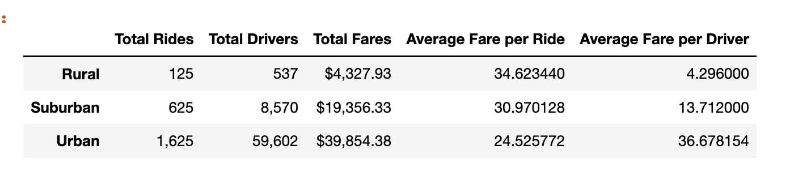
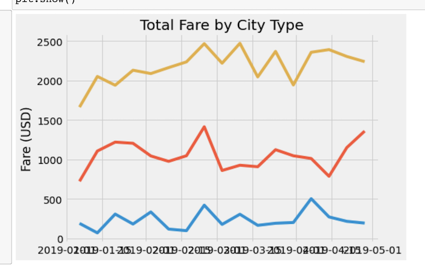

# PyBer_Analysis
Analysis using Mathplotlib, pandas and Numpy

# Overview of the analysis: 
  The purpose in this challenge is to analize a information of two data frames, which were merged, resulting in our final data set to analyze using pandas, numpy an matplotlib to visualize data.
  
  This challenge refers to the analysis of the ride-sharing data by city type, we have to show how fares differ from each city type (Urban, Suburban and Rural). We will use the resample() method to get a new data frame which contain data without NaN values, and this method also allows to display the information in weeks = 'W', months = 'M', year = 'Y' or day= 'D', because we have a date type in the index.
  Finally using Matplotlib we display the information for the final data frame to see how fares vary for each city type.
  

# Results: Using images from the summary DataFrame and multiple-line chart, describe the differences in ride-sharing data among the different city types.
The following image shows the results for the data wher we can observe the differences between the three typer of cities. The city containing the maximun number of Total rides is the "Urban" type with 1,625 rides, secondly the "Suburban" type with 625 and the thirdth place is for the "Rural" type with only 125 rides, we can realized that the Total Drivers is proportional to these values with 59,602, 8,570 and  537 drivers, as well as the Total Fares, we have less Total Fares for the Rural type, with $4,327.93, Suburban with $19,356.33 and $39,854.38 for the Urban type city, having the Average for this city types we can see a difference between the three of them, the highest Fare is for the Rural city, the medium fare is for the Suburban and the lowest fare is for the Urban city, we can think that this is due Urban Total Fares is almost 10 times more than Rural, the demand in ridings make this fare been reduced. Finally the Average Fare per Driver is higher inthe Urban city, the medium value is for the Suburban and the lowest fare corresponds to the Rural, determining that where there are more drivers, there are more rides then the drivers make more money.

# Summary: Based on the results, provide three business recommendations to the CEO for addressing any disparities among the city types.

